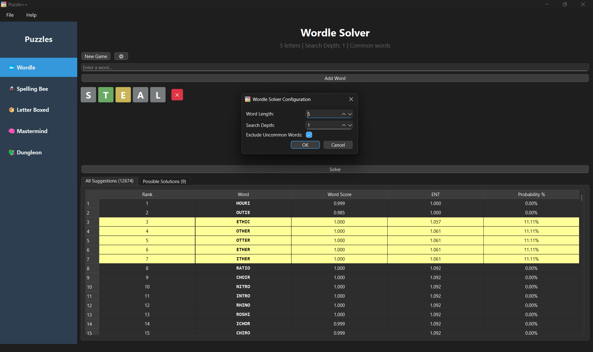
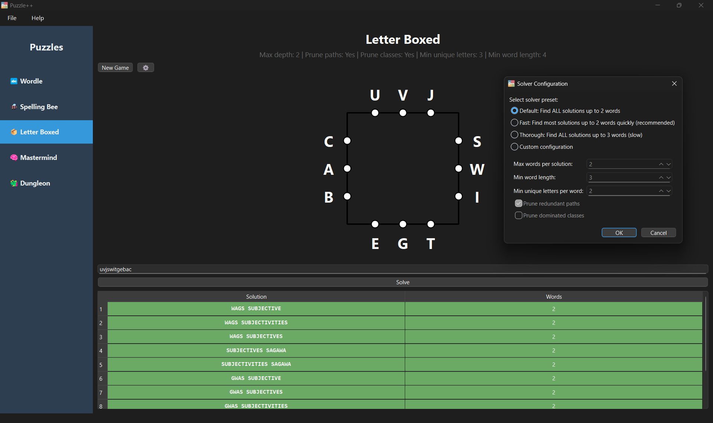
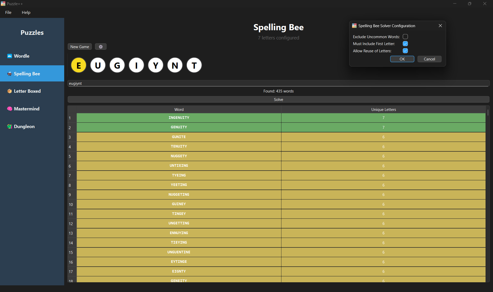
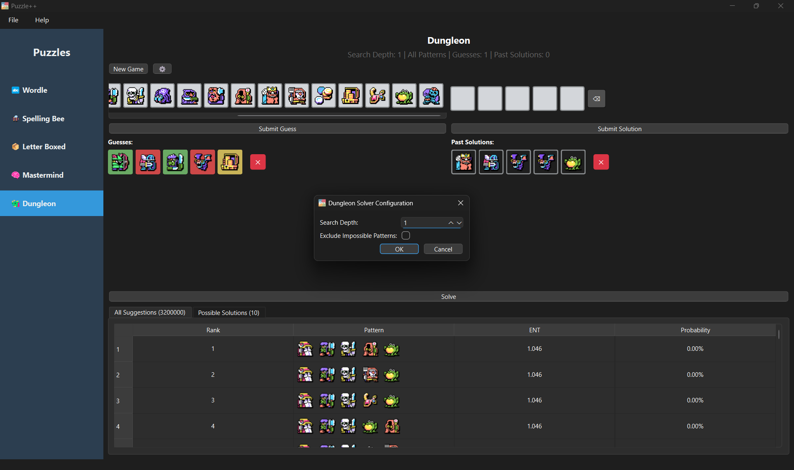
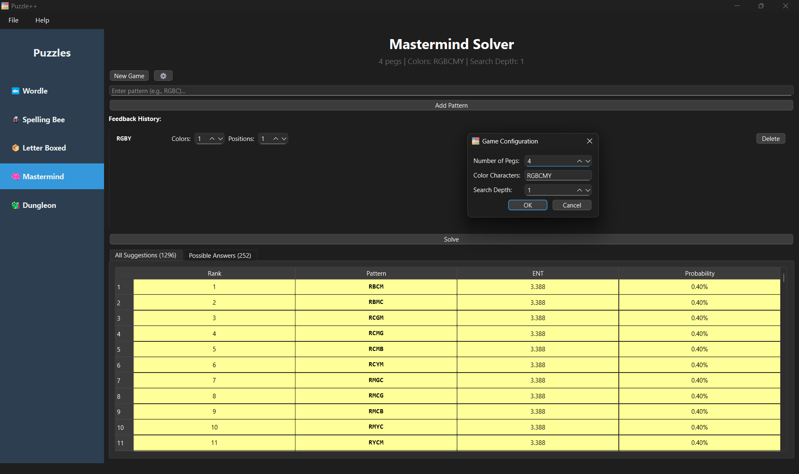
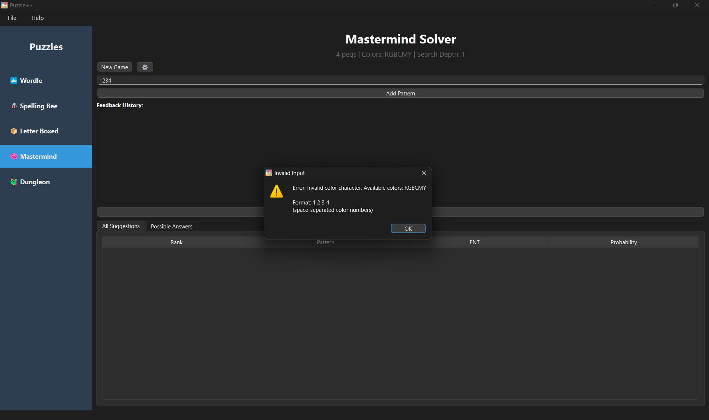

# Puzzle++ Final Project Report

**Project Title:** Puzzle++ - Advanced Word Game and Puzzle Solver

**Student Name:** Andrew Needham

**Course:** CSC 2210

**Term:** Fall 2025

**Date:** December 7, 2025

---

## 1. Introduction

Puzzle++ is a C++ application solving five popular puzzles (Wordle, Spelling Bee, Letter Boxed, Mastermind, Dungleon) using entropy-based algorithms. It provides both Qt6 GUI and command-line interfaces for puzzle enthusiasts, game developers testing difficulty, and students learning algorithms. The program offers optimal move suggestions, configurable performance presets, and supports batch processing.

---

## 2. Features and Requirements

**Core Features:**
- Five puzzle solvers (Letter Boxed, Spelling Bee, Wordle, Mastermind, Dungleon)
- Dual interface: Qt6 GUI and CLI (interactive/headless modes)
- Entropy-based optimization with configurable search depth
- Multiple solver presets, word list filtering, output management
- CMake build system with optional Qt dependency

**Extra Features:** Windows installer, automatic resource management, batch processing, gauntlet mode, performance benchmarking

**Limitations:** Deep search (depth ≥2) extremely slow; word list quality affects results; memory-intensive for thorough settings; GUI requires Qt 6.0+

---

## 3. Design

Puzzle++ follows modular, object-oriented design separating game logic from presentation:



*See `diagram.svg` or `diagram.mermaid` for close-up.*

**Core Architecture:**
- `IGame` interface: Base for all solvers (`runCLI()`, `runHeadless()`, `getGameName()`)
- Game classes: Implement IGame, handle user interaction
- Solver classes: Static functions with core algorithms
- `EntSolver<TGuess, TCandidate, TFeedback>`: Generic template for entropy-based solving

**Utilities:**
- `Utils`: Resource paths, word loading with caching, string utilities
- `InputUtils`: Interactive prompts, command-line parsing
- `Word` struct: Properties including score, letter counts

**GUI:** `MainWindow` manages `GameWidget` subclasses (WordleWidget, etc.) with threading and progress dialogs

---

## 4. Implementation

**Entropy Algorithm:** Calculates information entropy `H = -Σ(p(i) * log2(p(i)))` to maximize information gain per guess. Groups solutions by feedback patterns and selects moves minimizing expected remaining possibilities. Inspired by [3Blue1Brown's video](https://www.youtube.com/watch?v=v68zYyaEmEA&vl=en) on information theory.

**Data Structures:** `std::vector` (word lists), `std::map/unordered_map` (lookups), `std::array` (fixed storage), custom structs (type-safe configs)

**Letter Boxed:** Recursive backtracking with redundant path pruning and dominated class elimination

**Word Management:** Global caching, CSV format (word/score/difficulty), filtering by score threshold

**Design Trade-offs:**
1. Template-based `EntSolver`: Code reuse with compile-time optimization, but added complexity
2. Dual build config: CLI-only option without Qt, but requires dual testing
3. Configurable depth: Performance vs. quality balance, depth ≥2 impractical
4. Headless/interactive modes: Automation and usability, but dual maintenance

---

## 5. Testing

**Approach:** Automated unit tests (Google Test, 30+ tests), manual testing (normal/edge cases), regression testing

**Coverage:** All five solvers tested for feedback parsing, entropy calculations, constraint validation, edge cases (empty inputs, impossible puzzles, invalid data)

**Specific Test Examples:**

*Test 1 - Normal Input (Wordle):*
- **Input:** `./p++ wordle --guesses "CRANE 01120" --max-depth 1`
- **Expected:** Parse feedback (C=gray, R=yellow, A=yellow, N=green, E=gray), return ranked suggestions with entropy
- **Result:** ✅ Correctly identified words with N in position 4, R and A present but misplaced

*Test 2 - Edge Case (Letter Boxed impossible puzzle):*
- **Input:** `./p++ letterboxed --letters aaaaaaaaaaaa --preset 2`
- **Expected:** Detect no valid solutions, return empty result without crash
- **Result:** ✅ Returned "No solutions found" message

*Test 3 - Invalid Input (Spelling Bee):*
- **Input:** Interactive mode - enter only 2 letters (minimum 3 required)
- **Expected:** Reject with error message, re-prompt user
- **Result:** ✅ Displayed "Error: At least 3 letters required" and re-prompted

**Overall Results:** All 30+ automated tests pass on MSVC/MinGW. Manual testing confirmed robust error handling.

---

## 6. Screenshots



*Wordle solver GUI with entropy-ranked suggestions*



*Wordle solver with entropy rankings | Letter Boxed showing 2-word solutions*



*Spelling Bee solver with valid words list*



*Spelling Bee word list | Dungleon with complex feedback*



*Mastermind solver with color feedback*



*Error handling for invalid inputs*

---

## 7. Memory Leak Check

**Tool:** MSVC AddressSanitizer (ASan)

**Steps Used:**
```bash
cmake --preset msvc-debug
cmake --build build/msvc-debug --config Debug
set ASAN_OPTIONS=log_path=.\asan_report
"build\msvc-debug\Debug\p++.exe" -i
# [Ran all five game modes, performed multiple operations, exited normally]
```

**Output:** No `asan_report.*` files generated in directory. ASan only creates reports when errors are detected.

**Summary:** ✅ **Zero memory leaks detected.** RAII principles, smart pointers (`std::unique_ptr`, `std::shared_ptr`), STL containers (`std::vector`, `std::map`), and Qt parent-child ownership ensure proper cleanup. All dynamic memory is managed automatically.

**Note:** Tracy profiler (optional development tool, disabled in release builds) has known thread-related leaks documented in TODO.md, but this does not affect production code.

---

## 8. Learning Reflection - Was This Project Worth the Time?

**What I Learned:**

This project provided invaluable hands-on experience with advanced C++ and software engineering. Key learnings include:
- **Template programming:** Implementing the generic `EntSolver` class deepened understanding of C++ templates, type requirements, and compile-time optimization beyond basic STL containers
- **Build systems:** CMake multi-configuration builds with optional dependencies (Qt, Tracy, Google Test) taught professional build management and cross-platform considerations
- **GUI frameworks:** Qt6 work exposed event-driven programming, signals/slots architecture, and the critical importance of separating business logic from presentation layers
- **Algorithm analysis:** Implementing entropy-based algorithms brought abstract information theory into concrete practice, teaching pragmatic performance trade-offs
- **Modern C++:** RAII principles, smart pointers, move semantics, and STL containers fundamentally changed how I approach resource management

**Concepts That "Clicked":**

Move semantics and object lifetime management finally made sense when optimizing the word list caching system. Watching the entropy algorithm guide the solver to optimal guesses was intellectually satisfying - seeing information theory work in practice.

**Was It Worth It?**

Absolutely yes. This project mirrors real-world software development with multiple interfaces, performance constraints, and deployment packaging - directly transferable industry skills. Creating a polished, cross-platform application with comprehensive documentation demonstrates software engineering maturity beyond just coding ability. The deep engagement with C++20, build systems, and testing produced durable knowledge through applied problem-solving. Successfully completing this complex project builds genuine confidence for future software challenges in coursework and career. While time-intensive, the puzzle-solving domain kept the work engaging and intellectually rewarding throughout.

---

## 9. Course Feedback for the Instructor

**What Helped Most:**

- **Project flexibility:** Freedom to choose problem domains maintained motivation and encouraged creative ownership throughout the semester
- **Incremental milestones:** Phased approach (proposal, design diagram, interim check-in, final) prevented last-minute rushes and enabled iterative refinement with feedback
- **Modern C++ focus:** Emphasis on C++17/20 features and best practices felt current and industry-relevant, preparing us for contemporary codebases

**Suggestions for Improvement:**

1. **Build system introduction:** 1-2 lab sessions on CMake basics early in semester would help students structure projects properly from the start. Many struggle with build configuration.
2. **GUI framework coverage:** Brief Qt overview (widgets, signals/slots) would lower the barrier for students choosing GUI projects. Even a simple example would help.
3. **Memory debugging workshop:** Hands-on session with AddressSanitizer/Valgrind would save significant debugging time and build confidence with these tools.
4. **Example projects:** Providing 1-2 well-structured example codebases would help students visualize professional organization patterns (multi-file projects, header/implementation separation).
5. **Timeline adjustment:** Consider moving final deadline 1-2 weeks earlier or having presentations shortly before final report to avoid finals week convergence.
6. **Peer review opportunities:** Informal code review sessions would help students learn to critique constructively and see different problem-solving approaches.

**Overall Assessment:**

This course successfully bridges introductory programming and professional software development. The project-based approach is more valuable than exam-based assessment for this material, as it requires producing working, polished software that reflects real-world standards. Thank you for designing a course that challenges students to create work we can be genuinely proud of.

---

## 10. Conclusion

Puzzle++ successfully combines advanced algorithms, modern C++ practices, and thoughtful UI design. Delivered: five puzzle solvers, dual interfaces, entropy optimization, Windows installer, zero memory leaks. The modular architecture enables future extensibility while demonstrating software engineering maturity in balancing performance, code clarity, and scope.

---

## References

**Libraries:** Qt6, CMake, Tracy Profiler, Google Test/Benchmark

**Resources:** NSWL 2023 word list, SOWPODS dictionary, Dungleon game assets

**AI Assistance:** GitHub Copilot and Google Gemini used for code generation and debugging. All AI-generated code manually reviewed and tested.

**Algorithm Inspiration:** [3Blue1Brown - Solving Wordle using information theory](https://www.youtube.com/watch?v=v68zYyaEmEA&vl=en)

---

## Appendix

### Known Issues

- Tracy profiler memory leaks (debug-only, documented in TODO.md)
- Letter Boxed UI: Enter button required before solve
- Windows installer: Start menu entries, license info, publisher name need updates

**Future Work:** Generic ENT solver refactoring, additional puzzles (Waffle, Hangman, Strands), performance optimizations (multi-threading, WebAssembly), mobile ports. See `TODO.md` for details.