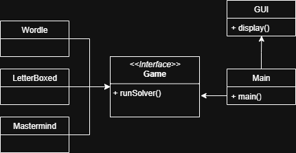

# CSC 2210 Final Project: C++ Puzzle Game Solver

### Team Members
- Andrew Needham

## Introduction

### Motivation
There are many games that use words and puzzles as a part of a challenge. For instance Wordle is a game in which you must guess a 5-letter word based on clues for each letter after each guess. Computers can be used to solve these games quickly and efficiently. C++ can be used as a highly performant language to solve these types of games using efficient algorithms and word frequency data.

### Objective
This project will be based off of a prior project that I did in my own time, which was creating a basic solver for Wordle and similar games.
The goal of this project is to use C++ to create hyper-optimized solvers of common word and puzzel games such as Wordle, Letter Boxed, and Mastermind.
I will use C++ for it's high performace and improve upon prior work that I've done to further optimize the algorithms used with additional knowledge I have learned.

## Design
The design of this application will use different classes for the solving algorithms for each game, as well as a a CLI interface for uses to use the program. A GUI framework could also be implemented for an easier user experience.

### Diagram

### Key Features
- Wordle Solver
- Letter Boxed Solver
- Spelling Bee Solver
- Mastermind Solver
- Command line and interactive execution methods
- Possible GUI for user interaction

### Tools/Libraries
Several standard C++ libraries will need to be used for common data structures and file operations. Some libraries include `<string>`, `<vector>`, `<algorithm>`, and `<set>`. If moving forward with a GUI, additional libraries and frameworks like Qt will need to be used.

## Conclusion

### Expected Inputs
A list of English words and frequencies will be needed for many of the algorithms. This will be found online and built into the application, or as a separate file that will be read during runtime.
The user will have to enter the information for each puzzle or game such as available letters and guess results.

### Expected Results
Ideally, the user will be able to interact with the program to quickly and accurately solve for solutions of various word games and puzzles. The algorithms used should be sufficiently optimized to run quickly on the machine.

### Potential Challenges
Some potential challenges I may run into is making sure the program can be easily compiled for other people and that it will run as expected on different machines. It may also be difficult to get the file I/O working properly and everything optimized efficiently. Creating the GUI will also be one of the more challenging aspects of the project as it may be difficult to integrate with other functions.

## Timeline
- Week 5: Planning
- Week 6: Submit proposal
- Week 8: Have basic working demo
- Week 9: 3-minute presentation
- Week 15: Submit final project 